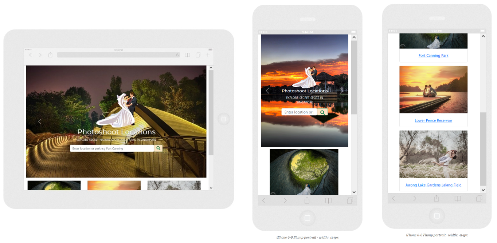
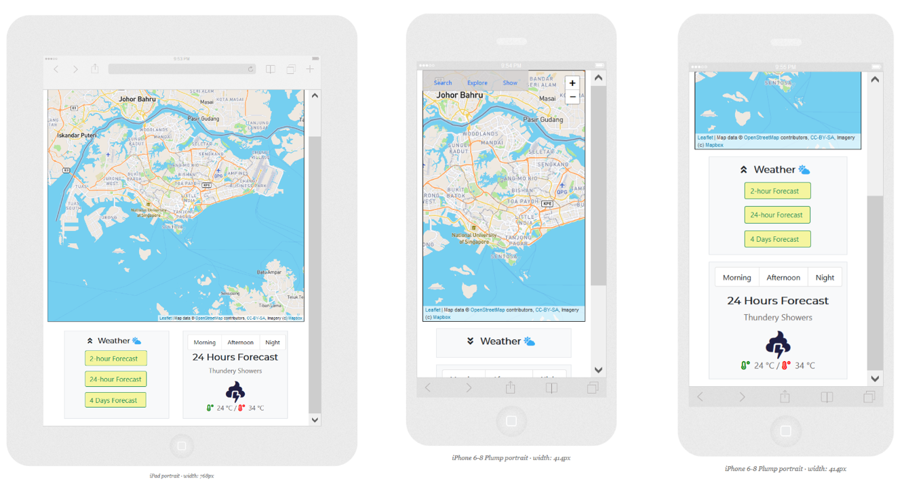
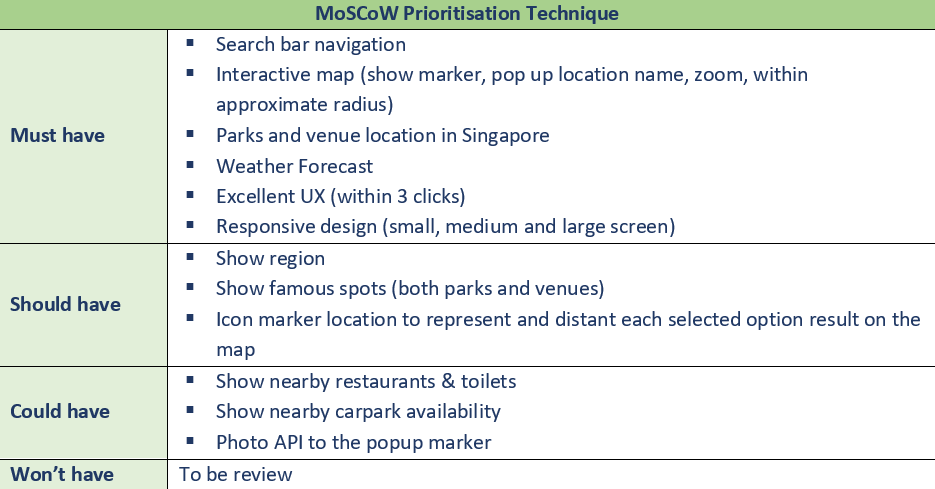

# Pre-wedding Photoshoot Locations

## Demo

A live website of the application can be found here: https://annette-p.github.io/pre-wedding-photoshoot-locations/

## Company and Product Summary

Bridal rental business: an online rental business specialised in bridal services from bridal rental (ranging from pre-wedding, ROM, receptions and etc), photography and video motion services. 

### User goal

Ability to plan different outdoor locations and what’s nearby for pre-wedding photoshoot in advance. 

### Product goal

Provide ability to view locations (by query, recommendation, by region) and its relative weather & temperature of respective days for better planning especially for outdoor photoshoot plan. 

## Product & Features

This is a single page application. The page is divided into 2 sections, the landing page and the map page.

### Landing Page
 

On the landing page, the app will first address to the users with greetings and a search bar to encourage user to type something to search. The map section will be triggered when the user presses down the "Enter" key or click on the search button.

### Map Navigation Page
 

On the map section, information/functions are organised into 2 sections:

 

Navigation bar section:

* **Float Navbar panel**
  * Search
    * Search results of parks and Foursquare locations will be
    * Details of the parks including images will be displayed whenever available
    * User can interact with the map through clicking on the result link, or on marker, the map will zoom in to show the targeted marker with location name and what’s are within 1km radius. 
    * Users can clear the search by pressing on “clear result” button. 
  * Explore
    * Allow user to interact with the map to explore more by the recommendation of famous photo-shooting spots
    * User can switch between each checkbox options
    * User can also show the region which will divide Singapore into each region. 
  * Hide
    * Allow hiding of the Navbar panel so the map can be viewed unobstructed across devices of all sizes

 

* **Weather Forecast section**
  * Weather Forecast option buttons
    * 2-hours Forecast 
    * 24-hours Forecast
    * 4 days Forecast

  * Display result
    * Respective result will be displayed 
    * The respective weather icon will be displayed and plot on the map
    * Click on weather icon will be zoom to location.
    * User can choose to view the weather by regions on the map too
    * 24-hours Forecast, can be viewed by period of the day (morning, afternoon and night).
    * 4 days Forecast, will displayed the high-low temperature.

 

 * **Map section**:
   * Both search navigation bar and weather forecast data will be plot and interactive on the map.

For more details on device simulation, refer [here](device_simulator.pdf)

## Technologies Used

* **HTML 5**
 To structure the content of the website.
* **CSS**
 To add stylistic touches to the website.
* **Bootstrap 5.1**
 To structure the layout of the website (i.e. Navbar, cards, interactive container) and ensure website is mobile responsiveness.
* **GoogleFonts**
 To style the typography on the website to enhance the visual experience of users.
* **FontAwesome 5.15.4**
 Uses the icons provided by FontAwesome 4.7 to enhance the user experience by making user interaction with the application more intuitive.
* **Leaflet 1.71**
 Mobile-friendly interactive maps API to plot out Singapore map. 
* **Four Square**
 Location data platform API to plot locations/venues on Leaflet map. 
* **National Park data**
 GeoJSON data to locate parks in Singapore (managed by National Parks Board) 
* **2 hours weather forecast**
 To display the latest two hour weather forecast for multiple areas in Singapore which were updated half-hourly from NEA.
* **24 hours weather forecast**
 To provide the latest 24 hour weather forecast that was updated multiple times throughout the day
* **4 days weather forecast**
 To provide the latest 4 day weather forecast which was updated twice a day from NEA
* **Singapore regions boundary (geojson MultiPolygon)**
 To provide indicative polygon of region boundary, divides Singapore into regions to plot on Leaflet map

## User Experience (UX)

### User Persona

Refer to [report](project_report.pdf) for details

### Wireframe

For full details of wireframe, refer [here](wireframe.pdf).

### Surface Plane

**Responsiveness**

This website is responsive to small, medium and large screen sizes. It is a mobile first approach application.

**Colours**

Refer to this [colour palette](green_grey_palate.pdf).

**Typography**

**Google font (Montserrat, sans-serif)**: its simple geometric letters which make the design appealing and have a large X-height. It provides the vibes of trust and can go best with maximum fonts. The font has a charming tale, features friendly and open curves.  This makes for a more natural reading rhythm more commonly found in humanist and serif types.

**Layout**

**Collapsible Tab** is used to make sure the map can be viewed unobstructed across devices of all sizes and user can hide and show the search options as desired. 

**The element view hight (vh)** is designed at 80% view hight of the screen in order to have other element sections appear on the screen in the same time. This is to inform users to scroll down for other details. 

## Software Application Development

### Product prioritization

 

### Estimation and Planning

Refer to [report](project_report.pdf) for details on the following areas:

* **Release planning (Tasks feature break down)** 
* **Agile estimation (Sprint planning)**
* **Test Case and Acceptance Criteria**

## Future development features

* Show nearby restaurants & toilets 
* Show nearby carpark availability 
* Fourquare Photo API 

## References

* Credit data for Park, Singapore regions boundary and weather data to data.gov.sg
* Venue data are from foursquare.com
* Images are from: 
  * https://singaporebrides.com/
  * https://www.xeplanner.com/
  * https://hitcheed.com/
  * http://www.perfectweddings.sg/
  * https://www.blissfulbrides.sg/
  * https://www.onethreeonefour.com/
